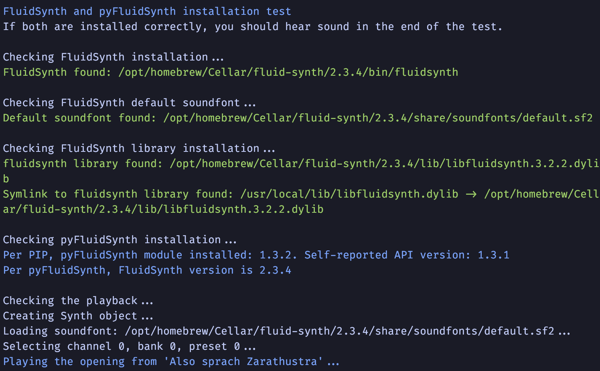

# pyfluidsynth-test
A quick test of the installation of the [FluidSynth](https://www.fluidsynth.org) 
and its integration with [pyFluidSynth](https://pypi.org/project/pyFluidSynth/).

What are those?
- [FluidSynth](https://www.fluidsynth.org) is a free popular software synthesizer
- [pyFluidSynth](https://pypi.org/project/pyFluidSynth/) is the Python API wrapper for the synth

The test checks the following:
- installation of the FluidSynth binary
- availability of the FluidSynth library to pyFluidSynth
- availability of the `default.sf2` soundfont file
- installation of the pyFluidSynth module
- availability of FuidSynth APIs to pyFluidSynth
- MIDI events via pyFluidSynth APIs

The test provides suggestions on how to fix the identified issues.

The test works on **Linux** and **macOS**.

## Dependencies

The test, of course, depends on [pyFluidSynth](https://pypi.org/project/pyFluidSynth/).

On macOS, the test expects the FluidSynth to be installed by [homebrew](https://formulae.brew.sh/formula/fluid-synth).

## Usage

`python pyfluidsynth-test.py`

## Test Output

## Note on `default.sf2`

[FluidSynth](https://www.fluidsynth.org) does not come with any soundfont files but expects the `default.sf2` file to be found 
in a certain location. 
Plenty of free soundfont files can be found online, for example:
https://sites.google.com/site/soundfonts4u/.
